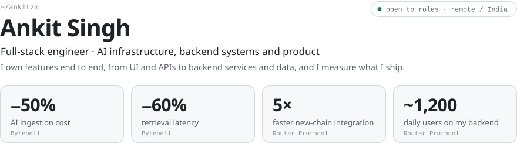

<picture>
  <source media="(prefers-color-scheme: dark)" srcset="assets/hero-dark.svg">
  
</picture>

<p>
  <a href="https://ankitsingh.xyz"><b>Portfolio & case studies</b></a> &nbsp;·&nbsp;
  <a href="https://resume.ankitsingh.xyz">Resume</a> &nbsp;·&nbsp;
  <a href="https://linkedin.com/in/ankitzm">LinkedIn</a> &nbsp;·&nbsp;
  <a href="https://x.com/ankitzm">X</a> &nbsp;·&nbsp;
  <a href="mailto:fig@ankitsingh.xyz">fig@ankitsingh.xyz</a>
</p>

<br>

### What I can build

<picture>
  <source media="(prefers-color-scheme: dark)" srcset="assets/capabilities-dark.svg">
  
</picture>

<br>

### Selected work

| | What it is | Built with |
|:--|:--|:--|
| [**Spinneret**](https://github.com/ankitzm/spinneret) | A scraping pipeline that heals itself in CI and can tell a broken scraper from a real price change. Zero bad rows shipped, by construction. | TypeScript, GitHub Actions, Next.js |
| [**Palladium**](https://github.com/ankitzm/palladium) | An explorer and REST API for every Avalanche L1, fed by a four-stage ingestion pipeline into time-series Postgres. | Next.js 16, Hono, Drizzle, Neon |
| [**Clarity**](https://github.com/ankitzm/clarity) | Turns ChatGPT share links into summaries, action items and interactive mind maps, streamed as they generate. | React 19, Puppeteer, OpenRouter |
| [**chat-agent-backend**](https://github.com/ankitzm/chat-agent-backend) | A reference agent runtime with per-session memory, optional Pinecone RAG and SSE streaming. | Fastify, Zod, OpenRouter |
| [**Terms Simplified**](https://github.com/ankitzm/terms-simplified) | A Chrome extension that flags harmful clauses in terms and conditions before you accept them. | Manifest V3, Perplexity Sonar |
| [**safe-deploy**](https://github.com/ankitzm/safe-deploy) | Deploy contracts from the CLI with MetaMask signing in the browser, so your private key never enters your dev environment. 500+ downloads. | Node.js, Hardhat |

<sub>More projects and write-ups are on <a href="https://ankitsingh.xyz">ankitsingh.xyz</a>.</sub>

<br>

### Experience

```text
* 2026.08  freelance        client web apps, dashboards and internal tools
* 2026.04  bytebell         owned code ingestion + OAuth connectors · −50% cost · −60% latency
* 2025.10  freelance        Next.js, Vue and NestJS apps for clients
* 2024.05  meme duels       real-time tap-trading game on Solana, built from scratch
* 2024.03  router protocol  Nitro swap UI · CEX withdrawals on 30+ chains · rewards backend, ~1,200 DAU
* 2023.04  thirdfi          developer relations · 1,000+ developers onboarded
* 2022.05  blocktrain       daily technical writing, videos, college meetups
* 2021.08  prepbytes        community · coding contest with 700+ registrations
```

<details>
<summary><b>Full stack</b> &nbsp;<sub>75 tools, grouped by layer</sub></summary>
<br>
<picture>
  <source media="(prefers-color-scheme: dark)" srcset="assets/stack-dark.svg">
  
</picture>
</details>
